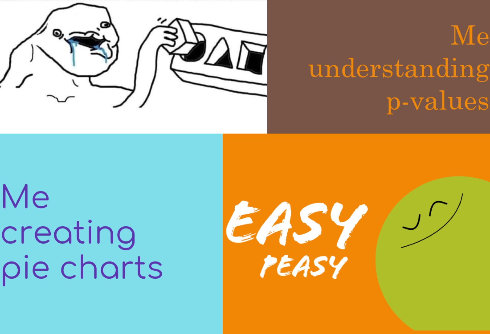

# MEME...
Below is a *meme* I made with the **R package** {https://cran.r-project.org/web/packages/magick/vignettes/intro.html}.



## Motivation
> #### The meme reflects my feelings toward:
>
> - Analysing *p-values* = a nightmare 
> - Creating pie charts = a piece of cake  

### `R` code for my meme creation:
```r
library(magick)

#square one
confused_face <- image_read("https://www.meme-arsenal.com/memes/f7300ccad0575bc19d9c8ee76acd5e82.jpg") %>% 
  image_scale(600)

#square two
confused_text <- image_blank(width = 500,
                          height = 300,
                          color = "#795548") %>%
  image_annotate(text = "Me\nunderstanding\np-values",
                 color = "#ED8808",
                 size = 60,
                 font = "Century Schoolbook",
                 gravity = "east")

#square three
easy_text <- image_blank(width = 500,
                         height = 450,
                         color = "#80DEEA") %>%
  image_annotate(text = "Me\ncreating\npie charts",
                 color = "#5E35B1",
                 size = 70,
                 font = "Comfortaa",
                 gravity = "west")

#square four
easy_face <- image_read("https://cdn.dribbble.com/users/5310050/screenshots/12667763/media/6fe82de7f8a16fbe3e3e7032f272307b.png") %>%
  image_scale(600)


row_one <- image_append(c(confused_face, confused_text))

row_two <- image_append(c(easy_text, easy_face))


the_meme <- c(row_one, row_two) %>%
  image_append(stack = TRUE) %>%
  image_scale(2000)


image_write(the_meme, "my_meme.png")
```
